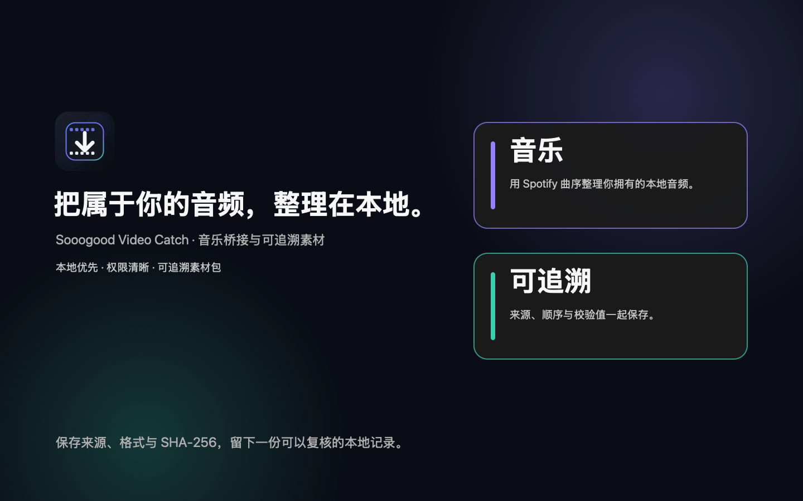

# App Store 素材与文案草案

以下文案与截图方向用于 App Store Connect 的本地化素材，提交前由产品负责人和法务确认平台名称、商标和地区限制。

## 中文（简体）

- 名称：`Sooogood Video Catch`
- 副标题：`音乐桥接与本地素材整理`
- 推广文案：`把属于你的音频，整理成可复核的素材包。`
- 关键词：`音乐整理,本地音频,歌单,专辑,素材包,播放列表,校验`
- 描述：`Sooogood Video Catch 是一个本地优先的音乐桥接与素材清单工具。商店版使用 Spotify 的曲目身份、专辑和歌单顺序整理你拥有的本地音频，严格标出版本冲突，逐字节复制到音频素材包，并生成 playlist.m3u8 与 SHA-256 provenance。商店版不下载第三方站点音视频，不读取浏览器 Cookie，不抓取 Spotify 音频；音频字节只来自你明确选择的本地文件或获授权的 DRM-free 直链。`

## 英文

- Subtitle: `Bridge playlists locally`
- Promotional text: `Organize owned audio with clear provenance.`
- Keywords: `music,playlist,album,audio,library,provenance,metadata`
- Description: `Sooogood Video Catch is a local-first music bridge and provenance tool. The Mac App Store edition uses Spotify track identity, album data, and playlist ordering to organize local audio you own, flags version conflicts, copies confirmed sources byte-for-byte, and writes playlist.m3u8 plus SHA-256 provenance. It does not download third-party site video or audio, read browser cookies, or capture Spotify audio. Audio bytes come only from files you explicitly choose or an authorized DRM-free direct URL.`

## 截图顺序与画面文案

1. 首页：`一个清晰的本地音乐素材工作台。`
2. 音乐已载入：`用 Spotify 曲序整理你自己的音频。`
3. 匹配审核：`版本冲突明确标出，确认权留在你手中。`
4. 素材包完成：`音频、播放列表与校验清单一起保存。`
5. 设置与隐私：`凭据留在本机，来源边界清楚可见。`

截图使用 16:10 的 macOS 窗口，深色背景、无个人账号、无真实 Cookie、无受版权保护的音频字节。Spotify 只展示来源标识和元数据，不展示“下载 Spotify 音乐”等误导性表述。商店截图只展示 Store profile；本地完整版的“视频”页面属于独立渠道，不应混入本套商店素材。

## 封面预览

本地完整版（非 App Store 渠道）使用同一品牌系统的 [MediaFetch-local-cover-1440x900.png](MediaFetch-local-cover-1440x900.png)，不与商店版宣传物料混用。

## 封面说明

- 文件：`MediaFetch-store-cover-1440x900.png`，1440×900、无 alpha 的实心 RGB PNG；源稿由 `Scripts/render_store_cover.swift` 生成，改版时只改脚本和品牌令牌，不直接手工覆盖导出图。
- 视觉层级：左侧依次为 Sooogood Video Catch 标志、主标题、产品副标题和“本地优先 · 非 DRM · 可追溯素材包”；右侧为“音乐 / 可追溯”两个入口卡片的抽象轮廓，表达商店版产品结构而不是具体平台下载承诺。
- 色彩：背景 `#0A0C11`，一级表面 `#141821`，视频强调 `#4B8DFF`，音乐渐变 `#8067FF → #32C7A0`；不从 Spotify 封面提取颜色，也不把封面模糊成背景。
- 禁用项：不放 YouTube、Vimeo、Spotify 等平台 Logo，不出现“破解”“绕过 DRM”“下载 Spotify 音乐”或“下载所有流媒体”等表述，不放真实账号、Cookie、音频字节或个人路径。
- 替代文字：`Sooogood Video Catch 本地音乐整理与可追溯素材包；使用 Spotify 曲序整理用户自己的音频。`
- 使用边界：这是品牌/推广封面，不替代 App Store 要求的真实应用截图；真实截图必须在解锁的 macOS 上从同一个 release bundle 重新采集，并按每个 storefront 的尺寸规则导出。

## Cover notes (English)

- File: `MediaFetch-store-cover-1440x900.png`, an opaque 1440×900 RGB PNG generated by `Scripts/render_store_cover.swift`.
- Composition: the Sooogood Video Catch mark, title and local-first subtitle sit on the left; abstract “Music” and “Provenance” cards sit on the right. The artwork communicates organization and traceability, not third-party media downloading.
- Restrictions: no YouTube, Vimeo, Spotify or other platform logos; no DRM-bypass, “download Spotify music” or “download all streaming” claims; no account data, cookies, private paths or protected audio bytes.
- Alt text: `Sooogood Video Catch local music organization and provenance package; Spotify ordering is used to organize audio the user owns.`
- This is a marketing cover, not an App Store screenshot. Real screenshots must be captured from the same signed Store bundle and validated independently.
